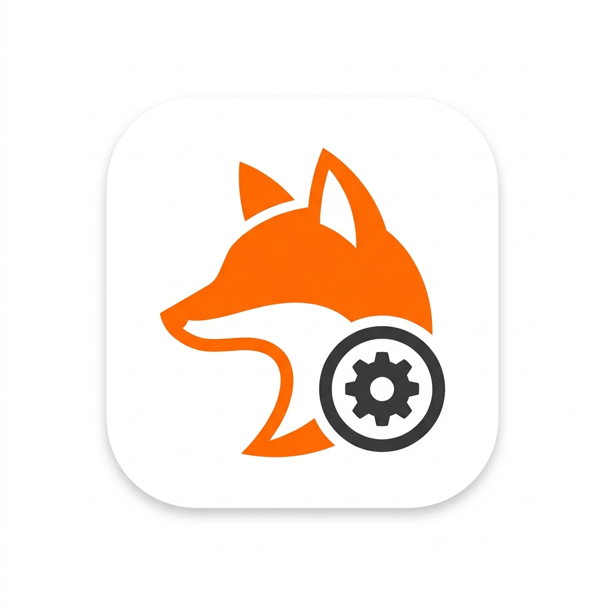

# FoxESS Smart Home Assistant Integration



A lightweight, robust, and smart Home Assistant integration for **FoxESS H12 Smart** inverters (and compatible H3 series) via Modbus TCP.

This is a custom-built, highly optimized integration created to pull precise and reliable data directly from your FoxESS inverter using a local Modbus TCP connection. It avoids the cloud entirely, making your smart home completely independent and ultra-fast.

## ✨ Features

- **Blazing Fast Local Polling:** Communicates directly with your FoxESS inverter over your local network using Modbus TCP.
- **Smart Energy Dashboard Integration:** Automatically configures your Home Assistant Energy Dashboard with the correct Grid, Solar, and Battery sources at the click of a button!
- **Interactive Control:** Read *and write* settings directly from Home Assistant:
  - **Work Mode** (Self Use, Back Up, Feed-in First, Force Time Use)
  - **Min SoC (Netzbetrieb/On Grid)**
  - **Min SoC (Notstrom)**
  - **Max SoC**
- **Robustness:** Built-in safeguards against common Modbus lockups, dynamic polling intervals, and safe failover logic (e.g. for single-battery setups where BMS2 is not available).
- **Zero-downtime Options Flow:** Change IP addresses, ports, or timeouts without having to delete and re-add the integration.
- **Custom Service API:** Need raw JSON data for advanced Node-RED automations? The `foxess_smart.get_all_values` service provides an instant dump of all current registers.

## 📥 Installation

### Method 1: HACS (Recommended)
1. Open Home Assistant and go to **HACS**.
2. Click on the 3 dots in the top right corner and select **Custom repositories**.
3. Add the URL to this GitHub repository and select the category `Integration`.
4. Click **Install** on the new `FoxESS Smart` integration.
5. Restart Home Assistant.

### Method 2: Manual Installation
1. Download the latest release from this repository.
2. Extract the `custom_components/foxess_smart` folder.
3. Copy the `foxess_smart` folder into your Home Assistant's `config/custom_components` directory.
4. Restart Home Assistant.

## ⚙️ Configuration

1. Go to **Settings > Devices & Services** in Home Assistant.
2. Click **Add Integration** and search for "FoxESS Smart".
3. Enter your inverter's IP Address (Host), Port (usually 502), and Slave ID (usually 3).
4. *(Optional)* Check the box to automatically configure your Energy Dashboard.

If your inverter IP changes in the future, simply click **Configure** on the integration tile to update the settings without losing historical data!

## 🔧 Services

This integration exposes the `foxess_smart.get_all_values` service. 

When called, it returns a full JSON payload containing all the raw Modbus values currently tracked by the integration. This is incredibly useful for developers or advanced Node-RED automations.

```yaml
service: foxess_smart.get_all_values
```

## 🛠 Supported Hardware
- **FoxESS H12 Smart** (H3-12.0-E)
- *Most FoxESS H3 series inverters with Modbus TCP enabled (e.g. via LAN/WiFi adapter).*

## 📝 License
This project is provided "as is". Feel free to fork, adapt, and use it in your own Smart Home!
